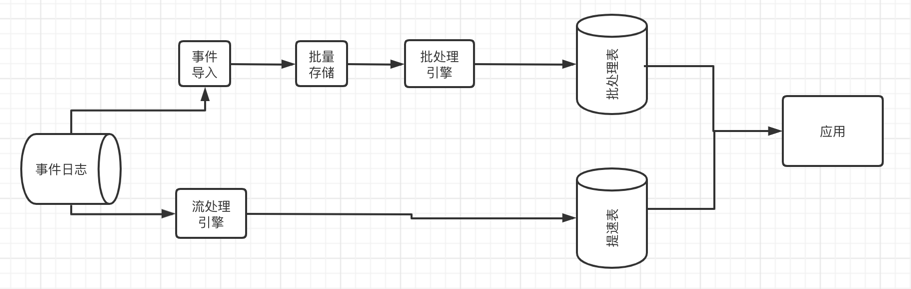

# 状态化流处理概述
## 传统数据处理架构
### 事务性处理
企业在日常业务运营过程中会用到各类应用，eg：ERP、CRM等

### 分析型处理
存储于不同事务型数据库系统中的数据，可以为企业提供业务运营相关的分析见解。

ETL：对于分析类查询，通常不会再事务型数据库上执行，而将数据复制到一个专门用来处理分析类查询的数据仓库。
这个向数据仓库拷贝数据的过程被称为 提取-转换-加载。

ETL的基本流程：从事务型数据库中提取数据，将其转换为通用表示形式（可能包含数据验证、数据归一化、编码、去重、表模式转换等工作）

数仓中的查询可以分为两类：
- 定期报告查询，可用于计算业务相关的统计数据、如收入、用户增长、产出等
- 即席查询，通过解答特定问题来辅助关键性的商业决策，例如，通过查询来整合营收数字和电台广告中的投入，以评估市场营销的有效性。

### 状态化流处理
任何一个处理事件流的应用，如果要支持跨多条记录的转换操作，都必须是有状态的，即能够存储和访问中间结果。

有状态的流处理应用通常会从事件日志中读取事件记录，事件日志负责存储事件流并将其分布式化。

### 事件驱动型应用
事件驱动型应用是一类通过接收事件流触发特定应用业务逻辑的有状态的流失应用，根据业务逻辑的不同，此类应用可支持触发报警或发送电子邮件之类的操作，也可支
持将事件写入输出流以供其他同类应用消费使用

事件驱动型应用的典型应用场景有：
- 实时推荐（例如，在客户浏览商家页面的同时进行产品推荐）
- 模式识别或复杂事件处理（例如，根据信用卡交易记录进行欺诈识别）
- 异常检测（例如，计算机网络入侵检测）

### 数据管道
有状态的流处理应用的另一个日常用例是以低延迟的方式获取、转换并插入数据，我们将此类应用称为数据管道。

### 流式分析
ETL作业会周期性地把数据导入数据存储系统，并通过即席或计划查询处理数据。

流式分析应用不再需要等待周期性地触发。相反，它会持续获取事件流，以极低的延迟整合最新事件，从而可以不断更新结构。

流式分析应用常用于：
- 手机网络质量监控
- 移动应用中的用户行为分析
- 消费者技术中的实时数据即席分析

### 历史回顾

Lambda架构
- Lambda架构在传统周期性批处理架构的基础上添加了一个由低延迟流处理引擎所驱动的"提速器（speed layer）"，然而其自身却有很多明显的缺点。首先，该架构
需要在拥有不同API的两套独立处理系统之上实现两套语义相同的应用逻辑，其次，流处理引擎计算的结果只是近似的，最后，Lambda架构很难配置和维护。
  
### Flink 快览
Flink支持精确的流处理，能同时满足各种规模下对高吞吐和低延迟的要求；尤其是以下功能使其在同类系统中脱颖而出：
- 同时支持事件时间和处理时间语义。事件时间语义能够针对无序事件提供一致、精确的结果；处理时间语义能够用在具有极低延迟需求的应用中。
- 提供精确一次（exactly-once）的状态一致性保障
- 在每秒处理百万条事件的同时保持毫秒级别延迟。基于Flink的应用可以扩展到数千核心之上。
- 层次化的API在表达能力和易用性方面各有权衡。（DataStream、process function、Flink sql、Flink table API）
- 用于最常见存储系统的连接器，如Apache Kafka、ES、JDBC
- 支持高可用配置（无单点失效）和K8S、YARN、紧密集成，快速故障恢复，动态扩缩容作业等
- 允许在不丢失应用状态的前提下更新作业的程序代码，或进行跨Flink集群的作业迁移
- 提供了详细、可自由定制的系统及应用指标（metrics）集合，用于提前定义和响应问题
- Flink同时也是一个成熟的批处理引擎
  

