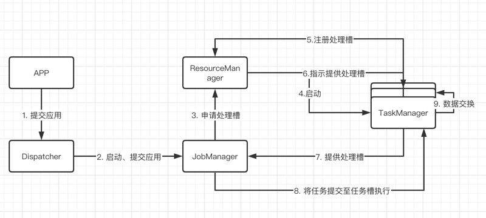
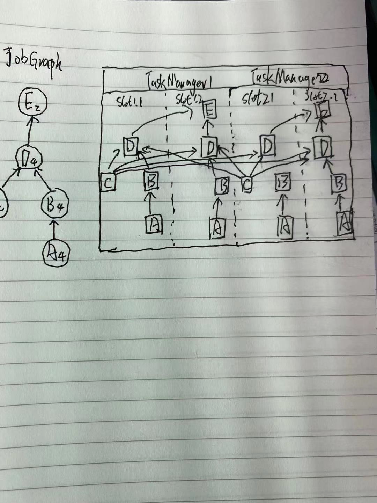
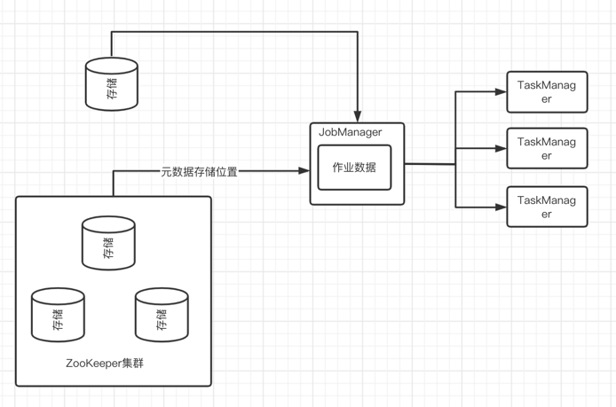
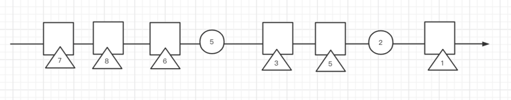
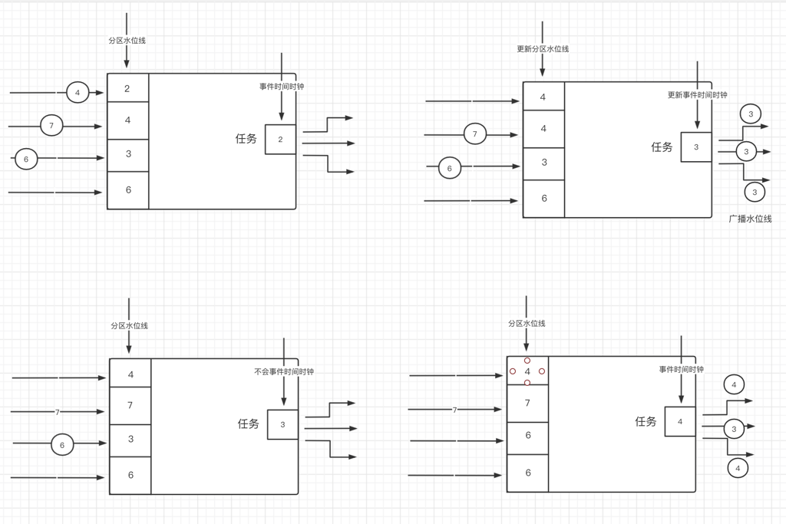

# 状态化流处理概述
## ApacheFlink架构
### Flink组件
Flink搭建需要四个不同组件，它们相互协作，共同执行流式应用，这些组件分别是：JobManager、ResourceManager、TaskManager、Dispatcher
#### JobManager
- 作为主进程（Master Process），JobManager控制着耽搁应用程序的执行。换句话说，每个应用都由一个不同的JobManager掌控。
- JobManager可以接收需要执行的应用，该应用包含一个所谓的JobGraph，即逻辑Dataflow图，以及一个打包了全部所需类、库以及其他资源的JAR文件，
- JobManager会把JobGraph转换为ExecutionGraph的物理Dataflow图，该图包含了哪些可以并行执行的任务。
- JobManager从ResourceManager申请执行任务的必要资源（TaskManager处理槽），一旦它收到了足够数量的TaskManager处理槽（slot），就会将
ExecutionGraph中的任务分发给TaskManager来执行。
- 在执行过程中，JobManager还要负责所有需要集中协调的操作，eg：创建检查点 等

#### ResourceManager
- 针对不同的环境和资源提供者（resource provider）（如 YARN、Mesos、Kubernetes或独立部署），Flink提供了不同的ResourceManager。
- ResourceManager负责管理Flink的处理资源单元—> TaskManager处理槽。
- 当JobManager申请TaskManager处理槽时，ResourceManager会指示一个拥有空闲处理槽的TaskManager将其处理槽提供给JobManager。
- 如果ResourceManager的处理槽数无法满足JobManager的请求，则ResourceManager可以和资源提供者通信，让它们提供额外容器来启动更多TaskManager
进程。同时ResourceManager还负责终止空闲的TaskManager以释放计算资源。

#### TaskManager
- TaskManager是Flink的工作进程（work process），通常在Flink搭建过程中要启动多个TaskManager。每个TaskManager提供一定数量的处理槽。处理
槽的数目限制了一个TaskManager可执行的任务数。
- TaskManager在启动后，会向ResourceManager注册它的处理槽。当接收到ResourceManager的指示时，TaskManager会向JobManger提供一个或多个处理
槽（slot）。之后JobManager就可以向处理槽中分配任务来执行。
- 在执行期间，运行同一应用不同任务的TaskManager之间会产生数据交换。

#### Dispatch
- Dispatch会跨多个作业运行，它提供了一个REST接口来让我们提交需要执行的应用。一旦某个应用提交执行，Dispatch会启动一个JobManager并将应用转交给它。
- REST接口意味着Dispatcher这一集群的HTTP入口可以受到防火墙的保护。
- Dispatch同时还会启动一个Web UI，用来提供有关作业执行的信息。

  
### 应用部署
Flink应用可以通过两种模式进行部署
#### 框架模式
- 在该模式下，Flink应用会打包成一个JAR文件，通过客户端提交到运行的服务上。(Flink Dispatcher、Flink JobManager、YARN的 Resource Manager)
- 如果应用提交到JobManager，则会立即执行；如果应用提交到Dispatcher或YARN ResourceManager，会启动一个JobManager并将应用转交给它，随后由
JobManager负责执行该应用。
  
#### 库模式
- 在该模式下，Flink应用会绑定到一个特定应用的容器镜像（如 Docker镜像）中。
- 镜像中还包含着运行JobManager以及ResourceManager的代码，当容器从镜像启动后会自动加载ResourceManager和JobManager，并将绑定的作业提交执行。
另一个和作业无关的镜像负责部署TaskManager容器。

### 任务执行
一个TaskManager允许同时执行多个任务。这些任务可以属于同一算子（数据并行），也可以是不同算子（任务并行），甚至还可以来自不同的应用（作业并行）。

TaskManager通过提供固定数量的处理槽来控制可以并行执行的任务数。每个处理槽可以执行应用的一部分，即算子的一个并行任务。

左侧的JobGraph（应用非并行化）包含了5个算子，其中算子A和C是数据源，算子E是数据汇。算子C和E的并行度是3，其余算子的并行度是4。
由于最大算子的并行度是4，因此应用若要执行则最少需要4个处理槽。

将任务以切片的形式调度至处理槽中有一个好处：
- TaskManager中的多个任务可以在同一进程内高效地执行数据交换而无须访问网络，然而，任务过于集中也会使TaskManager负载变高，继而可能导致性能下降。

### 高可用设置
#### TaskManager故障
假设一个Flink设置包含4个TaskManager，每个TaskManager有2个处理槽，那么一个流失应用最多支持以并行度8来运行，如果有一个TaskManager出现故障，则
可用的处理槽的数量就降到了6个，这时JobManager就会向ResourceManager申请更多的处理擦，若无法完成，JobManager就无法重启应用，直到有足够数量的可用
处理槽。

- 应用的重启策略决定了对JobManager以何种频率重启应用以及重启尝试之间的等待间隔。

#### JobManager故障
- 和TaskManager相比，JobManager用于控制流式应用执行以及保存该过程中的元数据（如已完成检查点的存储路径）。
- 如发生故障，导致JobManager成为Flink应用中的一个单点失效组件。为了解决该问题，Flink提供了高可用模式，支持在原JobManager消失的情况下，将作业
的管理职责及元数据迁移到另一个JobManager
  
Flink高可用模式是基于Apache Zookeeper来完成的。
- JobManager在高可用模式下工作时，会将JobGraph以及全部所需的元数据（例如 应用的JAR文件）写入一个远程持久化存储系统中。
- JobManager还会将存储位置的路径写入到Zookeeper的数据存储。
- 在应用执行过程中，JobManager会接收每个任务检查点的状态句柄（存储位置），在检查点即将完成的时候，如果所有任务已经将各自状态写入远程存储，JobManager
就会将状态句柄写入远程存储，并将远程位置的路径地址写入Zookeeper

当JobManager发生故障时，其下应用的所有任务都会自动取消。新接收工作的JobManager会执行以下步骤：
- 向Zookeeper请求存储位置，以获取JobGraph、JAR文件及应用最新检查点在远程存储的状态句柄
- 向ResourceManager申请处理槽来继续执行应用
- 重启应用利用最近一次检查点来重置任务状态

> Tips 如果是在容器环境（Kubernetes）中以库模式部署运行应用，容器编排服务（orchestration service）通常会自动重启故障的JobManager或TaskManager，

### Flink中的数据传输
在运行过程中，应用的任务会持续进行数据交换，TaskManager负责将数据从发送任务传输至接收任务。它的网络模块会在记录传输前会将它们收集到缓冲区中。换言之，
记录并非逐个发送的，而是在缓冲区中以批次形式发送。

- 每个TaskManager都有一个用于收发数据的网络缓冲池（默认32KB）
- 如果发送端和接收端的任务运行在不同的TaskManager进程中，它们就要用到操作系统的网络栈进行通信。
- 流式应用需要以流水线方式交换数据，因此每对TaskManager之间都要维护一个或多个永久的TCP连接来执行数据交换。
- 在Shuffle连接模式下，每个发送端任务都需要向任意一个接收任务传输数据，对于每一个接收任务，TaskManager都要提供一个专用的网络缓冲区，用于接收其他
  任务发来的数据
- 当发送任务和接收任务处于同一个TaskManager进程时，发送任务会将要发送的记录序列化到一个字节缓冲区中，一旦该缓冲区占满就会放到一个队列里。接收任务
会从这个队列里获取缓冲区并将其记录反序列化。
  
### 基于信用值（credit-based）的流量控制
Flink实现了一个基于信用值（credit-based）的流量控制机制，默认开启任务链接

它的工作原理如下：
- 接收任务会给发送任务授予一定的信用值，其实就是保留一些用来接收它数据的网络缓冲，一旦发送端收到信用通知，就会在信用值所限定的范围内尽可能多地传输
缓冲数据，并会附带上积压量（已经填满准备传输的网络缓冲数目）大小。接收端使用保留的缓冲来处理收到的数据，同时依据各发送端的积压量信息来计算所有相连
的发送端在下一轮的信用优先级
  
- 由于发送端可以在接收端有足够资源时立即传输数据，所以基于信用值的流控可以有效降低延迟。此外，信用值的授予是根据各发送端的数据积压量来完成的，因此该
机制还能在数据倾斜（data skew）时有效分配网络资源。
  
### 任务链接
Flink采用一种名为任务链接的优化技术来降低某些情况下的本地通信开销。

任务链接的前提是，多个算子必须有相同的并行度且通过本地转发通道（local forward channel）相连。

在任务链接模式下，多个算子的函数被"融合"到同一个任务中，在同一个线程内执行。函数生成的记录只需通过简单的方法调用就可以分别发往各自的下游函数，因此
基本函数之间的记录传输基本不会存在序列化及通信开销

### 事件时间处理
处理时间基于处理机器的本地时间，会产生一些较为随意，不一致且无法重现的结果，相反，事件时间会生成可重现且一致的结果

### 时间戳 
当Flink以事假时间模式来处理数据流时，会根据记录的时间戳触发时间相关算子的计算。

Flink内部采用8字节的Long值对时间戳进行编码，并将它们以元数据（metadata）的形式附加在记录上。内置算子会将这个Long值解析为毫秒精度的Unix时间戳。

### 水位线
Flink基于事件时间的应用还必须提供水位线（watermark），水位线用于在事件时间应用中推断每个任务当前的事件时间。基于时间的算子会使用这个时间来触发计
算并推动进度前进。

在Flink中，水位线是利用一些包含Long值时间戳的特殊记录来实现的。

水位线拥有两个基本属性：
- 必须单调递增。这是为了确保任务中的事件时间时钟正确前进，不会倒退。
- 和记录时间的时间戳存在联系，一个时间戳为T的水位线表示，接下来所有记录的时间戳一定都大于T

### 水位线传播和事件时间
Flink内部将水位线实现为特殊的记录，它们可以通过算子任务进行接收和发送。任务内部的时间服务（time service）会维护一些计时器（timer），它们依靠水位
线来激活。这些计时器是由任务在时间服务内注册，并在将来的某个时间点执行计算。

当任务接收到一个水位线时会执行以下操作：
- 基于水位线记录的时间戳更新内部事件时间时钟
- 任务的时间服务会找出所有触发时间小于更新后事件时间的计时器。对于每个到期的计时器，调用回调函数，利用它来执行计算或发出记录
- 任务根据更新后的事件时间将水位线发出

任务在接收到一个新的水位线之后，将如何发送水位线和更新其内部事件时间时钟？
- Flink会将数据流划分为不同的分区，并将它们交由不同的算子任务来并行执行，每个分区作为一个数据流，都会包含带有时间戳的记录以及水位线。根据算子的上
下游连接情况，其任务可能需要同时接收来自多个输入分区的记录和水位线，也可能需要将它们发送到多个输出分区。
  
一个任务会为它的每一个输入分区都维护一个分区水位线（partition watermark），当收到某个分区传来的水位线后，任务会以接收值和当前值取较大的那个值去
更新对应分区水位线的值。随后，任务会把事件时间时钟调整为所有分区水位线中最小的那个值。如果事件时间时钟向前推动，任务会先处理因此而触发的所有计时器，
之后才会把对应的水位线发往所有连接的输出分区，以实现事件时间到全部下游任务的广播。

Flink水位线处理和传播算法保证了算子任务所发出的记录时间戳和水位线一定会对齐。然而这依赖于一个事实：所有分区都会持续提供自增的水位线，只要有一个分区
的水位线没有前进，或分区完全空闲下来不再发送任何记录或水位线，任务的事件时间就不会前进，从而导致计时器无法触发。
因此，如果一个任务没有从全部输入任务以常规间隔接收新的水位线，就会导致时间相关算子的处理延迟或状态大小激增。

### 时间戳分配和水位线生成
时间戳和水位线通常都是在数据流刚刚进入流处理应用的时候分配和生成的。由于不同的应用会选择不同的时间戳，而水位线依赖于时间戳和数据流本身的特征，所以应
用必须显式地分配时间戳和生成水位线。

Flink DataStream应用通过三种方式完成该工作：
- 在数据源完成时： 我们可以利用SourceFunction在应用读入数据流的时候分配时间戳和生成水位线。源函数会发出一条记录流。每个发出的记录都可以附加一个时 
间戳，水位线可以作为特殊记录在任何时间点发出。如果源函数（临时性地）不再发出水位线，可以把自己声明成空闲。Flink会在后续算子计算水位线的时候把那些来
  自于空闲源函数的流分区排除在外。
  
- 周期分配器（periodic assigner）：DataStream API提供了一个名为AssignerWithPeriodicWatermarks的用户自定义函数，它可以用来从每条记录提取
时间戳，并周期性地响应获取当前水位线的查询请求。提取出来的时间戳会附加到各自的记录上，查询得到的水位线会注入到数据流中。
  
- 定点分配器（punctuated assigner）：另一个支持从记录中提取时间戳的用户自定义函数叫做 AssignerWithPunctuateWatermarks，它可用于需要根据
输入记录生成水位线的情况，该函数不会强制从每条记录中都提取一个时间戳。
  
### 状态管理
通常意义上，函数里所有需要任务去维护并用来计算结果的数据都属于任务的状态。

在Flink中，状态都是和特定算子相关联，为了让Flink的运行层知道算子有哪些状态，算子需要自己对其进行注册。根据作用域不同，状态可以分为两类：算子状态
（operator state）和键值分区状态（keyed state）

#### 算子状态（operator state）
算子状态的作用域是某个算子任务，这意味着所有在同一个并行任务之内的记录都能访问到相同的状态。

Flink为算子状态提供了三类原语：
- 列表状态（list state）：将状态表示为一个条目列表
- 联合列表状态（union list state）：同样是将状态表示为一个条目列表，但在进行故障恢复或从某个保存点启动应用时，状态的恢复方式和普通列表状态有所不同。
- 广播状态（broadcast state）：专门为那些需要保证算子的每个任务状态都相同的场景而设计，这种相同的特性将有利于检查点保存或者算子扩缩容。

#### 键值分区状态
键值分区状态会按照算子输入记录所定义的键值来进行维护和访问。Flink为每个键值都维护了一个状态实例，该实例总是位于那个处理对应键值记录的算子任务上。
当任务在处理一个记录时，会自动把状态的访问范围限制为当前记录的键值。

Flink为键值分区状态提供了不同原语，它们的区别在于分布式键值映射中每个键所对应存储值的类型不同。

键值分区状态中最常用的几个原语：
- 单值状态（value state）：每个键对应存储一个任意类型的值，该值也可以是某个复杂数据结构。
- 列表状态（list state）：每个键对应存储一个值的列表。列表中的条目可以是任意类型。
- 映射状态（map state）：每个键对应存储一个键值映射，该映射的键和值可以是任意类型。

### 状态后端
有状态算子的任务通常会对每一条到来的记录读写状态，因此高效的状态访问对于记录处理的低延迟而言至关重要。为了保证快速访问状态，每个并行任务都会把状态维
护在本地。至于状态具体的存储，访问和维护，则是由一个名为状态后端的可插拔组件来决定。

状态后端主要负责两件事：
- 本地状态管理
- 将状态以检查点的形式写入远程存储

Flink提供的一类状态后端会把键值分区状态作为对象，以内存数据结构的形式存入JVM中；另一类状态后端会把状态对象序列化后存到RocksDB中，RocksDB负责将
它们写入到磁盘上。

### 有状态算子的扩缩容
流式应用的一项基本需求是根据输入数据到达速率的变化调整算子并行度。

带有键值分区状态的算子在扩缩容时会根据新的任务数量对键值重新分区。但为了降低状态在不同任务之间迁移的必要成本，Flink不会对单独的键值实施再分配，而是
会把所有的键值分为不同的键值组（key group）每个键值组都包含了部门键值，Flink以此为单位把键值分配给不同任务。

> Tips：
> 带有算子列表状态的算子在扩缩容时会对列表中的条目进行重新分配。如果列表条目的数量小于算子新设置的并行度，部分任务在启动时候的状态就可能为空。
> 
> 带有算子联合列表状态的算子会在扩缩容时把状态列表的全部条目广播到全部任务上。随后由任务自己决定哪些条目该保留，哪些该丢弃。
> 
> 带有算子广播状态的算子在扩缩容时会把状态拷贝到全部新任务上。在缩容情况下，由于状态经过复制不会丢失，所以可以简单地停掉多出的任务。

### 检查点、保存点及状态恢复
Flink是一个分布式的数据处理系统，因此必须能够处理一些故障，例如：进程被强制关闭，机器故障以及网络连接中断。由于每个任务会把状态维护在本地，Flink要
保证发生故障时状态不丢不错。

#### 一致性检查点（checkpoint）
- Flink的故障恢复机制需要基于应用状态的一致性检查点
- 有状态的流式应用的一致性检查点是在所有任务处理完等量的原始输入后对全部任务状态进行的一个拷贝。

#### 从一致性检查点中恢复
在流式应用执行过程中，Flink会周期性地为应用状态生成检查点。一旦发生故障，Flink会利用最新的检查点将应用状态恢复到某个一致性的点并重启处理进程。

应用恢复要经过3个步骤：
- 重启整个应用。
- 利用最新的检查点重置任务状态。
- 恢复所有任务的处理。

如果所有算子都讲它们全部的状态写入检查点并从中恢复，并且所有输入流的消费位置都能重置到检查点生成的那一刻，那么该检查点和恢复机制就能为整个应用的状态
提供精确一次的一致性保障。

Flink的检查点和恢复机制仅能重置流式应用内部的状态。根据应用所采用的数据汇算子，在恢复期间，某些结果记录可能会向下游系统（如 事件日志系统、文件系统
或数据库）发送多次。

### Flink 检查点算法
Flink的检查点是基于 Chandy-Lamport分布式快照算法来实现的。该算法不会暂停整个应用，而是会把生成检查点的过程和处理过程分离，这样在部分任务持久化
状态的过程中，其他任务还可以继续执行。

Flink的检查点算法中会用到一类名为检查点分隔符（checkpoint barrier）的特殊记录，这些检查点分隔符会通过数据源算子注入到常规的记录流中。相对其他记
录，它们在流中的位置无法提前或延后。为了标识所属的检查点，每个检查点分隔符都会带有一个检查点编号，这样就把一条数据流从逻辑上分成了两个部分。

Flink检查点算法原理（基于Chandy-Lamport）：
- 当一个数据源任务收到消息后，会暂停发出记录，利用状态后端触发生成本地状态的检查点，并把该检查点分隔符连同检查点编号广播至所有传出的数据流分区。状态
后端会在状态存为检查点完成后通知任务，随后任务会给JobManager发送确认消息。在将所有分隔符发出后，数据源将恢复正常工作。
- 数据源任务发出的检查点分隔符会传输到与之相连的任务，检查点分隔符总是以广播形式发送，从而可以确保每个任务能从它们的输入都收到一个分隔符。当任务收到
一个新检查点的分隔符时，会继续等待所有其他输入分区也发来这个检查点的分隔符。同时，在等待过程中，会继续处理那些从未提供分隔符的分区发来的数据。对于已经 
提供分隔符的分区，它们新到来的记录会被缓存起来，不能处理，这个等到的过程，被称为 分隔符对齐。
- 任务在收齐全部输入分区发送的分隔符后，就会通知状态后端开始生成检查点，同时把检查点分隔符广播到下游相连的任务。
- 任务在发出所有的检查点分隔符后就会开始处理缓冲的记录。待所有缓冲区的记录处理完成后，任务继续继续处理输入流。
- 最终检查点分隔符到达数据汇任务。数据汇任务在收到分隔符后会依次执行分隔符对齐，将自身状态写入检查点，向JobManager确认已接收分隔符等一系列动作。
JobManager在接收到所有应用任务返回的检查点确认消息后，就会将此次检查点标记为完成。
  
### 检查点对性能的影响
Flink实现了一些调整策略，可以减轻某些条件下对性能的影响。
- 按照Flink的设计，是由状态后端负责生成检查点，因此任务的状态的具体拷贝过程完全取决于状态后端的实现。举例而言：文件系统状态后端和RocksDB状态后端
支持异步生成检查点。当检查点生成过程触发时，状态后端会为当前状态创建一个本地拷贝。在本地拷贝创建完成后，任务就可以继续它的常规处理。后台进程会将本地
状态快照拷贝到远程存储，然后在完成检查后通知任务。
- RocksDB支持 异步生成检查点，其可以有效降低任务恢复数据处理所需等待的时间，除此之外还支持增量生成检查点，这可以有效较低需要传输的数据量。
- 通过堆分隔符对齐进行调整，以降低检查点算法对处理延迟的影响。

### 保存点（save point）
- 原则上，保存点的生成算法和检查点完全一样，因此可以把保存点看作包含一些额外元数据的检查点。
- 保存点的生成不是由Flink生成的，而是需要由用户（或外部调度器）显式触发。同时，Flink也不会自动清理保存点。

#### 保存点的使用
检查点其实是故障恢复，在完全相同的集群上，以完全相同的配置，运行完全相同的应用。而保存点还能做更多事情
- 从保存点启动一个不同但相互兼容的应用。这意味着可以修复应用的一些逻辑Bug。需要注意的是，应用和保存点必须相互兼容，只有这样才能加载保存点内的状态。
- 用不同的并行度启动原应用，从而实现应用的扩缩容
- 在另一个集群上启动相同的应用。这允许把应用迁移到一个新的Flink版本，或者是一个不同的集群或数据中心。
- 利用保存点暂停某个应用。
- 为保存点设置不同版本并将应用状态归档。

#### 从保存点启动应用
每个应用都会包含很多算子，而每个算子又可以定义一个或多个的键值或算子状态。算子会在一个或多个任务上并行执行，因此一个典型的应用会包含多个状态，它们分
布在不同TaskManager进程内的算子任务上。

- 保存点中的状态副本会按照算子标识和状态名称进行组织。该算子标识和状态名需要能将保存点的状态数据映射到应用启动后的算子状态上。当应用从保存点启动后，
Flink会将保存点的数据分发到对应算子的任务上。
> 默认情况下，Flink会给每个算子分配一个唯一标识，但该标识是根据前置算子的标识按照某种确定规则生成的。这意味着任何一个前置算子发生改变都会导致该标识
发生改变，所以强烈建议手工指定算子标识。

